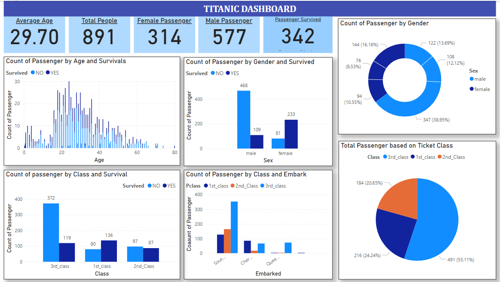

# Titanic Dataset Analysis - Power BI Dashboard

This repository contains a Power BI project that analyzes the famous Titanic dataset. The goal of this project is to provide interactive visual insights into the demographics, survival rates based on passenger class, gender and other patterns of the Titanic passengers using Power BI.

#Repository Contents

The original Titanic dataset used for this analysis.
The Power BI report file.
A snapshot image of the final dashboard for quick reference.
Project documentation.

# Dashboard Features

The Power BI dashboard includes the following insights:

- **Survival Analysis**: Count and percentage of passengers who survived vs. did not survive.
- **Class Distribution**: Visual breakdown of passengers by travel class (1st, 2nd, 3rd).
- **Gender and Age Impact**: Analysis of survival based on gender and age group.
- **Embarkation Points**: Number of passengers from each embarkation port (C, Q, S).
- **Interactive Filtering**: Slicers for filtering data by class, gender, and survival status.

# Tools Used

- **Power BI Desktop** (.pbix)
- **Microsoft Excel/CSV** for data preparation
- **Titanic Dataset** (in CSV format)

# How to Use

1. Clone this repository or download the files.
2. Open the pbix file using [Power BI Desktop](https://powerbi.microsoft.com/desktop/).
3. Explore the visualizations and filters on the report.
4. (Optional) Use the CSV file to recreate or modify the data model.

# Dataset Source

The Titanic dataset is a popular machine learning dataset made available by [Kaggle](https://www.kaggle.com/competitions/titanic/data) and contains information about passengers such as age, sex, ticket fare, class, and survival status.

# Contributions

Feel free to fork the project and enhance the visuals or data model. Pull requests are welcome!

---

**Author**: Mahmud Un Nabi   
